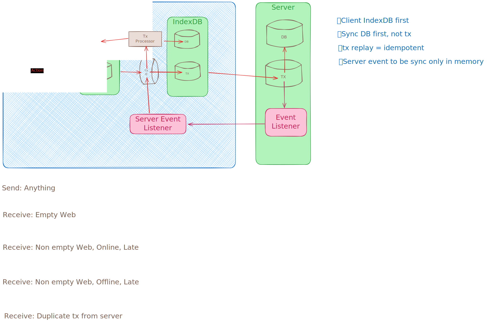

# OKR

# Features

- local first
- sync

# Design

# Todo

- [x] Last sync persistance
- [ ] Offline support
- [ ] Better queue in web (remove delay)
- [ ] Better event in server (remove polling)
- [ ] Jotai listener to avoid code duplication
- [ ] dynamic table naming in client
- [ ] PgLite listener
- [ ] Remove dead code
- [ ] Using dynamic table name based on create query
- [ ] Backend to be transactional

# To check

- [ ] If using a big object pool and calculating upfront is costly

# Not doing

- [ ] Error rollback
- [ ] Conflict handling
- [ ] Delete old tables

# Issues

- [ ] Complexity
- [ ] Client code to have a lot of business logic
- [ ] Db structure revealed
